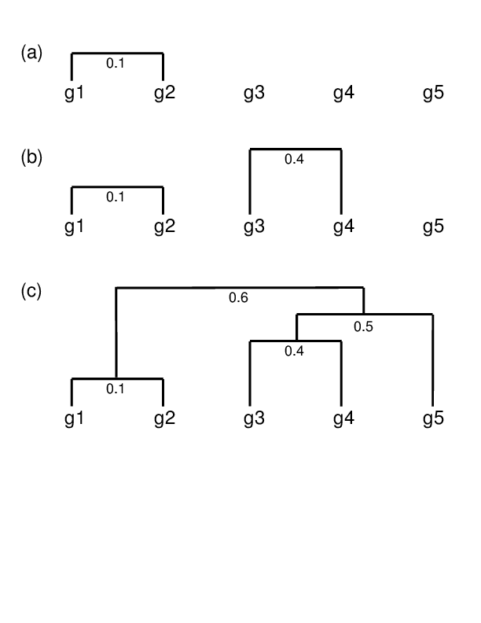
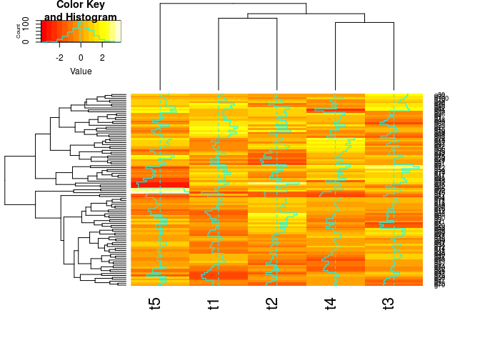

## Hierarchical Clustering

### Overview of algorithm 

1. Identify clusters (items) with closest distance  
2. Join them to new clusters
3. Compute distance between clusters (items)
4. Return to step 1

#### Hierarchical clustering: agglomerative Approach

#### Hierarchical Clustering with Heatmap

- A heatmap is a color coded table. To visually identify patterns, the rows and columns of a heatmap are often sorted by hierarchical clustering trees.  
- In case of gene expression data, the row tree usually represents the genes, the column tree the treatments and the colors in the heat table represent the intensities or ratios of the underlying gene expression data set.

### Hierarchical Clustering Approaches

1. Agglomerative approach (bottom-up)
    - R functions: `hclust()` and `agnes()`

2. Divisive approach (top-down)
    - R function: `diana()`

### Tree Cutting to Obtain Discrete Clusters

1. Node height in tree
2. Number of clusters
3. Search tree nodes by distance cutoff

### Create symbolic links 

For viewing les in IGV as part of `systemPipeR` workflows.

- `systemPipeR`: utilities for building NGS analysis [pipelines](https://github.com/tgirke/systemPipeR)

## Example

Using `hclust` and `heatmap.2`


library(gplots) 
y <- matrix(rnorm(500), 100, 5, dimnames=list(paste("g", 1:100, sep=""), paste("t", 1:5, sep=""))) 
heatmap.2(y) # Shortcut to final result


	

